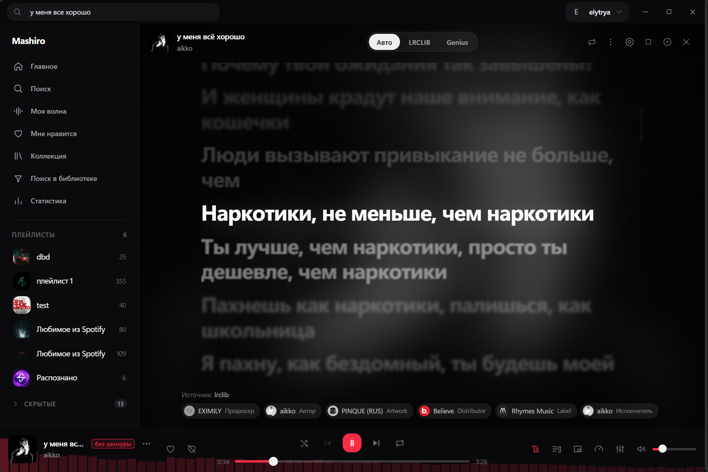

<div align="center">


# mashiro

неофициальный десктоп-клиент яндекс музыки на tauri 2 и vue 3

[](https://github.com/elytrya/yandex-music-client/releases)
[](https://github.com/elytrya/yandex-music-client)
[](LICENSE)
[](#сборка)

[](https://tauri.app)
[](https://vuejs.org)
[](https://www.typescriptlang.org)
[](https://www.rust-lang.org)

[](https://github.com/elytrya/yandex-music-client/commits)
[](https://github.com/elytrya/yandex-music-client/stargazers)
[](https://github.com/elytrya/yandex-music-client/issues)

</div>

<div align="center">



</div>

ооо "яндекс" к проекту отношения не имеет.

## стек

- фронтенд: vue 3 (composition api, script setup), typescript, quasar, pinia, vue router, vite
- бэкенд: rust, tauri 2, reqwest, serde, tokio

## возможности

### авторизация

- вход по готовому oauth-токену яндекса
- вход через встроенное окно авторизации с перехватом токена из редиректа
- токен хранится локально и подставляется в заголовки запросов на стороне rust
- выход из аккаунта с очисткой токена и локальных кешей

### воспроизведение

- очередь воспроизведения с перемешиванием и тремя режимами повтора
- кроссфейд с настраиваемой длительностью
- подрезание тишины в конце трека
- регулировка скорости воспроизведения
- восстановление очереди, текущего трека и позиции после перезапуска
- отдельный переключатель автозапуска восстановленного трека

### моя волна

- отдельная страница персональной радиостанции "моя волна"
- лайк, дизлайк и переход к следующему треку прямо из волны
- обратная связь уходит в яндекс, поток подстраивается под оценки

### обход цензуры

- если для трека есть незацензуренная версия в базе fckcensordata, играет она
- включено по умолчанию, отключается в настройках, раздел "поведение"
- когда обход выключен, список не загружается и подмена не применяется
  ни при воспроизведении, ни при предзагрузке
- метка отключается отдельно от самой подмены
- свой список замен и приоритет собственных правил над базой

### метка ai-музыки

- артисты сверяются с базой slopless
- метка в списках треков, в плеере и на странице артиста
- опциональный автодизлайк и пропуск таких треков

### библиотека

- лайки треков, альбомов и артистов, дизлайки треков
- плейлисты: создание, переименование, удаление, добавление и удаление треков
- поиск по собственной библиотеке без запросов в сеть
- страницы альбома, артиста и плейлиста с запуском всего списка
- экспорт плейлистов и лайков в txt или csv и импорт обратно по названиям

### текст песни

- три источника текста: lrclib и genius
- режим "авто" берёт сначала lrclib, затем genius
- синхронизированный текст с подсветкой строки и автопрокруткой
- переход по клику на строку, обычный текст если синхронизации нет
- переключение источника для отдельного трека прямо в панели

### genius

- авторы и продюсеры с genius.com
- отдельные страницы артиста и списка песен genius
- нужен бесплатный client access token, хранится только на этом компьютере

### эквалайзер и визуализатор

- многополосный эквалайзер с пресетами и ручной настройкой
- аудио-визуализатор с полосами частот в полноэкранном плеере

### мини-плеер и редактор макета

- отдельное компактное окно мини-плеера поверх других окон
- редактор макета плеера и мини-плеера: состав и расположение кнопок
- живой предпросмотр и сброс к исходному виду
- возврат к основному окну одним кликом

### загрузки

- сохранение треков в выбранную папку
- если трек уже скачан, воспроизводится локальный файл, а не поток
- это же работает для предзагружаемого следующего трека

### интеграции и системные функции

- discord rich presence с обложкой, названием и таймингом
- иконка в системном трее с меню управления
- сворачивание в трей вместо закрытия
- глобальные горячие клавиши, работают когда окно не в фокусе
- таймер сна с остановкой воспроизведения
- статистика прослушиваний с топами артистов и треков

### оформление

- светлая и тёмная темы, настраиваемый акцентный цвет
- полупрозрачные панели с регулируемой силой размытия
- отключаемые анимации и тонкие полосы прокрутки
- переключатели обложек в боковой панели и в плеере
- настраиваемые размеры интерфейса, плотность списков и форма обложек

## настройки

разделы: оформление, интерфейс, плеер, мини-плеер, поведение, плейлисты,
горячие клавиши, текст песни, genius, эквалайзер, загрузки, discord, кеш,
о проекте.

раздел "поведение" разбит на группы, у каждого переключателя есть описание того,
что именно он меняет:

| группа | что внутри |
| --- | --- |
| визуальные эффекты | размытие панелей, сила размытия, анимации, тонкие скроллбары |
| обложки и миниатюры | обложки плейлистов в боковой панели, обложка трека в плеере |
| окно и запуск | сворачивание в трей, восстановление очереди, автозапуск |
| воспроизведение | подрезание тишины в конце трека |
| фильтры контента | обход цензуры, метка о подмене, автодизлайк ai-треков |

## сборка

требуется node 18 или новее, npm, rust stable и системные зависимости tauri 2
для вашей ос (на windows - visual studio build tools и webview2, на linux - webkit2gtk).

режим разработки:

```bash
cd desktop
npm install
npm run tauri dev
```

сборка релиза:

```bash
cd desktop
npm run tauri build
```

готовые файлы окажутся в desktop/src-tauri/target/release/bundle.

## структура проекта

```
desktop/
  index.html
  quasar.config.js
  public/icons/         фавиконки всех размеров
  src/
    api/                клиент tauri-команд и типы ответов
    boot/               инициализация авторизации и нативных вызовов
    components/         компоненты интерфейса
      player/           редакторы макета плеера и мини-плеера
      settings/         переключатели, слайдеры и разделы настроек
    composables/        визуализатор частот
    css/                стили по страницам и компонентам
    lib/                цензура, ai-метки, источники текста, кеш картинок, диалоги
    pages/              главная, волна, поиск, артист, альбом, плейлист, genius, статистика, настройки
    router/             маршруты приложения
    stores/             pinia: плеер, библиотека, интерфейс, genius, статистика, таймер сна
  src-tauri/
    icons/              иконки приложения
    src/
      commands/         команды, доступные из фронтенда
      genius/           апи genius: поиск, артист, песня, тексты
      yandex/           апи: каталог, библиотека, радио, воспроизведение, тексты
      lrclib.rs         тексты из lrclib
      presence.rs       discord rich presence
      tray.rs           иконка в трее
      hotkeys.rs        глобальные горячие клавиши
      files.rs          загрузки и поиск локальных файлов
      mini.rs           окно мини-плеера
      oauth.rs          окно авторизации
```

## архитектура

весь сетевой обмен с апи идёт через rust: фронтенд вызывает tauri-команды,
rust ходит в апи, разбирает ответы и преобразует их в dto для интерфейса.
токен не покидает rust-часть при запросах.

состояние интерфейса живёт в pinia: плеер (очередь, предзагрузка, сессия,
presence), библиотека, настройки интерфейса, genius, статистика, таймер сна.

## хранение данных

| ключ | что хранится |
| --- | --- |
| mashiro.token | oauth-токен |
| mashiro.session | данные текущей сессии |
| mashiro.settings, mashiro.interface | настройки приложения и интерфейса |
| mashiro.equalizer | пресеты и полосы эквалайзера |
| mashiro.genius | токен и настройки genius |
| mashiro.stats, mashiro.artistStats | статистика прослушиваний |
| mashiro.censor.map | кеш списка незацензуренных версий |
| mashiro.censor.custom, mashiro.censor.prefer | свои замены и приоритет правил |
| mashiro.artistAvatars | кеш аватарок артистов |
| mashiro.imgcache.* | кеш внешних картинок |

все кеши чистятся из настроек, раздел "кеш".

## внешние источники данных

- fckcensordata: список треков с незацензуренными версиями
- slopless: список артистов с музыкой, сгенерированной нейросетями
- lrclib: синхронизированные и обычные тексты песен
- genius: авторы и продюсеры

если источник недоступен, клиент продолжает работать без соответствующей функции.

## известные ограничения

- используется неофициальное апи, любое его изменение может сломать часть функций
- без подписки полное воспроизведение недоступно
- базы цензуры и ai-меток пополняются сообществом и не полны
- для genius нужен свой client access token

## благодарности

- [MarshalX/yandex-music-api](https://github.com/MarshalX/yandex-music-api) - описание неофициального апи
- [vyfor/yandex-music-rs](https://github.com/vyfor/yandex-music-rs) - схемы ответов апи для rust-части
- [Hazzz895/FckCensor](https://github.com/Hazzz895/FckCensor) - логика подмены зацензуренных треков
- [Hazzz895/FckCensorData](https://github.com/Hazzz895/FckCensorData) - база ссылок на незацензуренные версии
- [alexeyfv/slopless](https://github.com/alexeyfv/slopless) - база артистов с ai-музыкой
- [lrclib](https://lrclib.net) - открытая база текстов песен

## дисклеймер

проект написан в образовательных целях, чтобы разобраться с tauri, vue и с тем,
как устроено неофициальное апи яндекс музыки. это не продукт и не замена
официальному клиенту.

- используется неофициальное апи. оно не документировано и может измениться в любой момент
- нужен свой аккаунт с активной подпиской. клиент не обходит платный доступ
- использование неофициального клиента может нарушать условия сервиса, вплоть до блокировки аккаунта

## лицензия

gpl-3.0.
